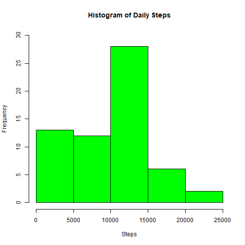
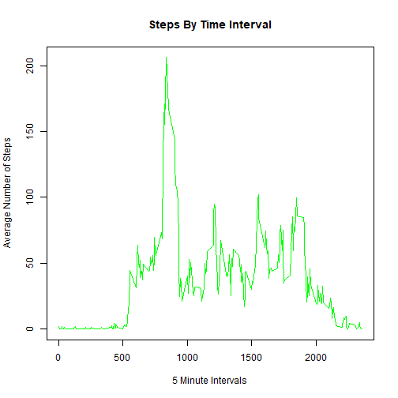
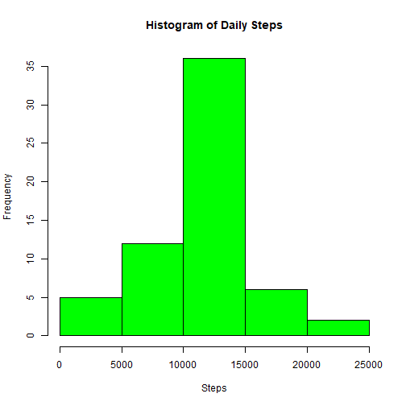
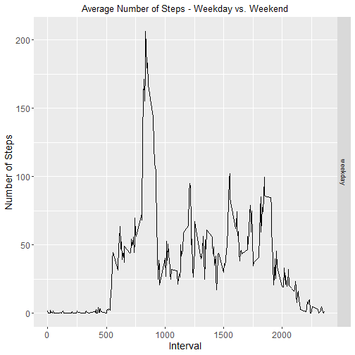

# Course Project 1 - Reproducible Research
## By Severino Herrera

Assignment:

This assignment will be described in multiple parts. You will need to write a report that answers the questions detailed below. Ultimately, you will need to complete the entire assignment in a single R markdown document that can be processed by knitr and be transformed into an HTML file.

Severino: This is the R markdown document, so that's done :D

## Data
The data for this assignment can be downloaded from the course web site:

Dataset: Activity monitoring data [52K]

The variables included in this dataset are:

  steps: Number of steps taking in a 5-minute interval (missing values are coded as NA)

  date: The date on which the measurement was taken in YYYY-MM-DD format

  interval: Identifier for the 5-minute interval in which measurement was taken

The dataset is stored in a comma-separated-value (CSV) file and there are a total of 17,568 observations in this dataset.

#Steps taken to achieve the assignment:

## 1 Step, Loading and preprocessing the data.

Before start i have to mention the use of the next libraries in my project:

```r
library(ggplot2)
library(dplyr)
```

First, i downloaded the data to a local folder in my pc and unzipped the file.
Next I used the following code to read the csv file;


```r
activity <- read.csv("D:/R/Reproducible/activity.csv")
activity$date <- as.Date(activity$date)
```

## 2 Step, What is mean total number of steps taken per day?

### 2.1 Calculate the total number of steps taken per day


```r
stepsPerDay <- activity %>%
        group_by(date) %>%
        summarize(Nofsteps = sum(steps, na.rm = TRUE)) 

stepsPerDay
```

```
## # A tibble: 61 x 2
##    date       Nofsteps
##    <date>        <int>
##  1 2012-10-01        0
##  2 2012-10-02      126
##  3 2012-10-03    11352
##  4 2012-10-04    12116
##  5 2012-10-05    13294
##  6 2012-10-06    15420
##  7 2012-10-07    11015
##  8 2012-10-08        0
##  9 2012-10-09    12811
## 10 2012-10-10     9900
## # ... with 51 more rows
```

### 2.2 Make a histogram of the total number of steps taken each day


```r
hist(stepsPerDay$Nofsteps, main = "Histogram of Daily Steps", 
     col="green", xlab="Steps", ylim = c(0,30))
```



### 2.3 Calculate and report the mean and median of the total number of steps taken per day


```r
meanNSTD <- round(mean(stepsPerDay$Nofsteps),digits = 2)
medianNSTD <- round(median(stepsPerDay$Nofsteps),digits = 2)

print(paste("The mean of the total number of steps taken per day is: ", meanNSTD))
```

```
## [1] "The mean of the total number of steps taken per day is:  9354.23"
```


```r
print(paste("The median of the total number of steps taken per day is: ", medianNSTD))
```

```
## [1] "The median of the total number of steps taken per day is:  10395"
```


## 3 Step, What is the average daily activity pattern?

### 3.1 Make a time series plot (i.e. type = “l”|) of the 5-minute interval (x-axis) and the average number of steps taken, averaged across all days (y-axis).


```r
tablestepsInt <- activity %>%
        group_by(interval) %>%
        summarize(meansteps = mean(steps, na.rm = TRUE)) 


tablestepsInt
```

```
## # A tibble: 288 x 2
##    interval meansteps
##       <int>     <dbl>
##  1        0    1.72  
##  2        5    0.340 
##  3       10    0.132 
##  4       15    0.151 
##  5       20    0.0755
##  6       25    2.09  
##  7       30    0.528 
##  8       35    0.868 
##  9       40    0     
## 10       45    1.47  
## # ... with 278 more rows
```


```r
plot(tablestepsInt$meansteps ~ tablestepsInt$interval,
     col="green", type="l", xlab = "5 Minute Intervals", ylab = "Average Number of Steps",
     main = "Steps By Time Interval")
```



```r
head(tablestepsInt,10)
```

```
## # A tibble: 10 x 2
##    interval meansteps
##       <int>     <dbl>
##  1        0    1.72  
##  2        5    0.340 
##  3       10    0.132 
##  4       15    0.151 
##  5       20    0.0755
##  6       25    2.09  
##  7       30    0.528 
##  8       35    0.868 
##  9       40    0     
## 10       45    1.47
```


### 3.2 Which 5-minute interval, on average across all the days in the dataset, contains the maximum number of steps?


```r
print(paste("Interval containing the most steps on average: ",tablestepsInt$interval[which.max(tablestepsInt$meansteps)]))
```

```
## [1] "Interval containing the most steps on average:  835"
```


```r
print(paste("Average steps for that interval: ",round(max(tablestepsInt$meansteps),digits=2)))
```

```
## [1] "Average steps for that interval:  206.17"
```


## 4 Step, Imputing missing values

### 4.1 Calculate and report the total number of missing values in the dataset (i.e. the total number of rows with NAs)


```r
print(paste("The total number of rows with NAs is: ",sum(is.na(activity$steps))))
```

```
## [1] "The total number of rows with NAs is:  2304"
```


### 4.2 Devise a strategy for filling in all of the missing values in the dataset. The strategy does not need to be sophisticated. For example, you could use the mean/median for that day, or the mean for that 5-minute interval, etc.

This was achieved in the creation of the table of the activity 3.1. Where we looked for records containing NA values. :D

### 4.3 Create a new dataset that is equal to the original dataset but with the missing data filled in.


```r
OrigFilled <- activity  
for (i in 1:nrow(activity)){
        if(is.na(activity$steps[i])){
                OrigFilled$steps[i]<- tablestepsInt$meansteps[OrigFilled$interval[i] == tablestepsInt$interval]
        }
}

head(OrigFilled,15)
```

```
##        steps       date interval
## 1  1.7169811 2012-10-01        0
## 2  0.3396226 2012-10-01        5
## 3  0.1320755 2012-10-01       10
## 4  0.1509434 2012-10-01       15
## 5  0.0754717 2012-10-01       20
## 6  2.0943396 2012-10-01       25
## 7  0.5283019 2012-10-01       30
## 8  0.8679245 2012-10-01       35
## 9  0.0000000 2012-10-01       40
## 10 1.4716981 2012-10-01       45
## 11 0.3018868 2012-10-01       50
## 12 0.1320755 2012-10-01       55
## 13 0.3207547 2012-10-01      100
## 14 0.6792453 2012-10-01      105
## 15 0.1509434 2012-10-01      110
```

vs Original table:


```r
head(activity,15)
```

```
##    steps       date interval
## 1     NA 2012-10-01        0
## 2     NA 2012-10-01        5
## 3     NA 2012-10-01       10
## 4     NA 2012-10-01       15
## 5     NA 2012-10-01       20
## 6     NA 2012-10-01       25
## 7     NA 2012-10-01       30
## 8     NA 2012-10-01       35
## 9     NA 2012-10-01       40
## 10    NA 2012-10-01       45
## 11    NA 2012-10-01       50
## 12    NA 2012-10-01       55
## 13    NA 2012-10-01      100
## 14    NA 2012-10-01      105
## 15    NA 2012-10-01      110
```

### 4.4 Make a histogram of the total number of steps taken each day and Calculate and report the mean and median total number of steps taken per day. Do these values differ from the estimates from the first part of the assignment? What is the impact of imputing missing data on the estimates of the total daily number of steps?


```r
stepsPerDay <- OrigFilled %>%
        group_by(date) %>%
        summarize(Nofsteps = sum(steps, na.rm = TRUE)) 

stepsPerDay
```

```
## # A tibble: 61 x 2
##    date       Nofsteps
##    <date>        <dbl>
##  1 2012-10-01   10766.
##  2 2012-10-02     126 
##  3 2012-10-03   11352 
##  4 2012-10-04   12116 
##  5 2012-10-05   13294 
##  6 2012-10-06   15420 
##  7 2012-10-07   11015 
##  8 2012-10-08   10766.
##  9 2012-10-09   12811 
## 10 2012-10-10    9900 
## # ... with 51 more rows
```


```r
hist(stepsPerDay$Nofsteps, main = "Histogram of Daily Steps", 
     col="green", xlab="Steps")
```



Now we calculate median and mean again with the table with no missing values (NAs)


```r
meanNSTD2 <- round(mean(stepsPerDay$Nofsteps),digits = 2)
medianNSTD2 <- round(median(stepsPerDay$Nofsteps),digits = 2)

print(paste("The mean after filling info: ", meanNSTD2))
```

```
## [1] "The mean after filling info:  10766.19"
```

```r
print(paste("The mean before filling info: ", meanNSTD))
```

```
## [1] "The mean before filling info:  9354.23"
```


```r
print(paste("The median after filling info: ", medianNSTD2))
```

```
## [1] "The median after filling info:  10766.19"
```

```r
print(paste("The median before filling info: ", medianNSTD))
```

```
## [1] "The median before filling info:  10395"
```

We can see how the result is different now that we are considering all the info. That's why cleaning and transforming your data is a key process to consider when working with data.

## 5 Step,Are there differences in activity patterns between weekdays and weekends?


### 5.1 Create a new factor variable in the dataset with two levels - “weekday” and “weekend” indicating whether a given date is a weekday or weekend day.


```r
activityF <- OrigFilled
activityF$date <- as.Date(activityF$date)
activityF$day <- ifelse(weekdays(activityF$date) %in% c("Saturday", "Sunday"), "weekend", "weekday")
activityF$day <- as.factor(activityF$day)
```

### 5.2 Make a panel plot containing a time series plot (i.e. type=“l”) of the 5-minute interval (x-axis) and the average number of steps taken, averaged across all weekday days or weekend days (y-axis).


```r
activityWeekday <- filter(activityF, activityF$day == "weekday")
activityWeekend <- filter(activityF, activityF$day == "weekend")

activityWeekday <- activityWeekday %>%
        group_by(interval) %>%
        summarize(steps = mean(steps)) 
activityWeekday$day <- "weekday"

activityWeekend <- activityWeekend %>%
        group_by(interval) %>%
        summarize(steps = mean(steps)) 
activityWeekend$day <- "weekend"

wkdayWkend <- rbind(activityWeekday, activityWeekend)
wkdayWkend$day <- as.factor(wkdayWkend$day)


g <- ggplot (wkdayWkend, aes (interval, steps))
g + geom_line() + facet_grid (day~.) + 
        theme(axis.text = element_text(size = 12),axis.title = element_text(size = 14)) + 
        labs(y = "Number of Steps") + labs(x = "Interval") + 
        ggtitle("Average Number of Steps - Weekday vs. Weekend") + 
        theme(plot.title = element_text(hjust = 0.5))
```


